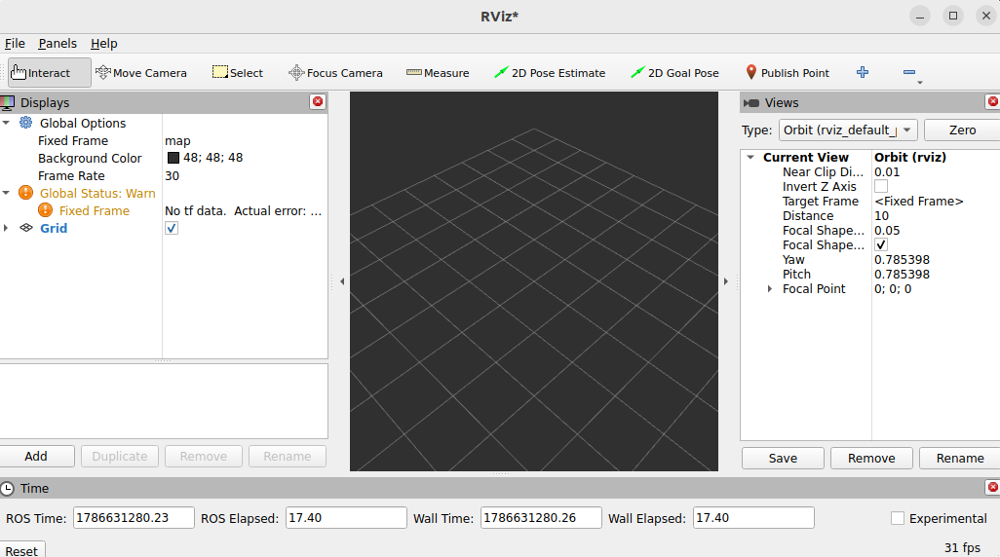
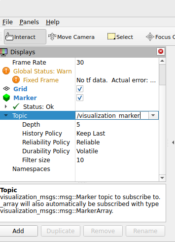
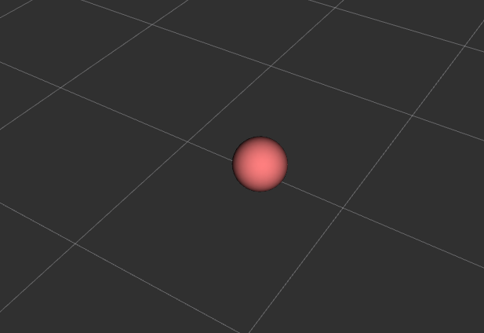

# RViz Marker Publisher: Tutorial Part 1

**Robotics and Autonomous Systems Group, Research Engineering Facility, Research Infrastructure** 
**Queensland University of Technology**

 


[](https://www.gnu.org/licenses/gpl-3.0)

----

## Prerequisites

This tutorial requires a ROS2 (`jazzy`) environment, a workspace at `${ROS2_WS}` and the `rviz_marker_publisher` package has been installed under `${ROS2_WS}/src/`.    

Execute the following commands to build the workspace and to update the environment variables so that ROS2 can find the example programs provided by this repository.

```bash
source /opt/ros/jazzy/setup.bash

cd ${ROS2_WS}
colcon build --event-handlers console_direct+ 
source instll/setup.bash
```
> [!NOTE]
> Do not know how to setup the ROS environment for running the example programs? Use the link below for the installation guide.
>
> [Installation Guide](./INSTALL.md).
>

## The First Example Program 

The example program `intro_0.py` provides a basic example of using `rviz_marker_publisher` to publish a marker.  

### Running the Example

1. Launch _RViz2_ and configure the display to include `Marker`, `MarkerArray`, and `PointCloud2`.

```bash
rviz2
```



- At the bottom of the _Display_ panel, press the __Add__ button.  On the popup, select _Marker_ from the list and press __OK__ to confirm
- A _Marker_ placeholder is now added to the Display list. 
- Enter `/visualization_marker` in the _topic_ textbox under _Marker_. RViz2 will subscribe to the topic and receive markers published to the topic.



- Repeat the above and add _MarkerArray_ and _PointCloud2_ to the display.  The topics for the two display types are given in the table below.  

| Display Type  |          Topic        |
| :----------------  | :------         |
| Marker      | `/visualization_marker` |
| MarkerArray | `/visualization_marker_array` | 
| PointCloud2 | `/visualization_cloud` | 

- These are the default topics defined by `rviz_marker_publisher`.  

2. Launch the example program `intro_0.py`. The suffix `.py` is omitted in the command.

```bash
ros2 run rviz_marker_publisher intro_0
```
- The program will clear the 3D scene and publish a red sphere at position (1, 1, 1).



### Using the Package: Essential Setup 

The file `intro_0.py` is listed below.

```python
import time
import rclpy
from rclpy.node import Node
from visualization_msgs.msg import Marker
import rviz_marker_publisher
from rviz_marker_publisher import RvizMarkerPublisher, get_logger
logger = get_logger()

def main():
    # section 1: enable ROS2 node and create the RVizVisualizer 
    rclpy.init()
    the_node:Node = Node(node_name='test_rv_node') 
    rv = RvizMarkerPublisher(the_node)
    rviz_marker_publisher.spin_in_thread(the_node)
    # section 2: wait for the discovery and matching of publishers and subscribers 
    logger.info('(wait) discovery and matching of publishers and subscribers')
    time.sleep(2.0)
 
    # section 3: create a sphere marker and publish it with the RVizVisualizer 
    logger.info('(add) create_sphere_marker and wait for 5 seconds')
    sphere_marker:Marker = rviz_marker_publisher.create_sphere_marker(name='sphere', id=1, xyz=[1, 1, 1], frame_id='map', scale=0.50, rgba=[1.0, 0.5, 0.5, 1.0])
    rv.publish(sphere_marker) 

    # pause before terminate until Enter is press
    input('Press Enter to terminate')
    rclpy.shutdown()
```

The purpose of section 1 of the function `main` is to enable the program to participate in the ROS2 environment and to launch an instance of `RvizMarkerPublisher`. A `RvizMarkerPublisher` instance will execute as an active component interacting with other ROS2 computational nodes.

```python
def main():
    rclpy.init()                                # initialize the ROS2 software and communication layer
    the_node = Node(node_name='test_rv_node')   # establish this process as part of the ROS2 environment
    # create the RVizVisualizer 
    rv = RvizMarkerPublisher(the_node)              # create an instance of RvizMarkerPublisher, the parameter node enables RvizMarkerPublisher to publish markers to other ROS2 computation nodes such as rViz2 
    rviz_marker_publisher.spin_in_thread(the_node)  # create a thread for RvizMarkerPublisher to actively manage and publish markers
```

The next section pause the process to allow time for the discovery and matching of publishers and subscribers, so that the RViz, as a subscriber, will receive markers when published by the example program. 

```python
    ...
    logger.info('(wait) discovery and matching of publishers and subscribers')
    time.sleep(2.0)
```

In section 3 one of the marker creation functions of `rviz_marker_publisher` is called to create a sphere marker. Then the `publish` function is called to request the `RvizMarkerPublisher` instance to publish the marker.  

```python
    ...
    sphere_marker:Marker = rviz_marker_publisher.create_sphere_marker(name='sphere', id=1, xyz=[1, 1, 1], frame_id='map', scale=0.50, rgba=[1.0, 0.5, 0.5, 1.0])
    rv.publish(sphere_marker) 
    ...
```

The function `create_sphere_marker` returns a populated `Marker` object based on the passed parameters.

| Function parameters | Definition                              | Remarks | 
| :----------------   | :------                              | :------        |
| `name`              | A string indicating the namespace of the marker | Many visualization tools organize markers of the same namespace into a group for control functions |
| `id`                | An integer for identification  | The `name` and `id` together uniquely identify a marker |
| `xyz`               | The position of the sphere in the frame of reference | A 3-tuple (x, y, z) of `float` values |
| `frame_id`          | The frame of reference | default to be the __fixed frame__ of the scene |
| `scale`             | The size of the sphere | a single number or a 3-tuple (lx, ly, lz) indicating the 3-dimensional size |
| `rgba`              | The color | either a 3-tuple (r, g, b) or 4-tuple (r, g, b, a) of `float` values in the range [0, 1] |
| `lifetime`          | The marker will remain visible for this number of seconds | default is 0 meaning it will persist indefinitely |

- The `name` and `id` uniquely identify a marker object published to a topic. A new marker will replace an old marker if the composite tuple of `name` and `id` is the same.
- A marker with a `lifetime` of 0 will persist indefintely until the termination of RViz2 or the marker is de-selected in RViz2 (either as a namespace or as a topic). A marker with a positive `lifetime` should be automatically removed by RViz2 (or other visualization tools).

---

## Persistence of Markers

Generally, the `RvizMarkerPublisher` supports three modes of marker persistence.

### Publish Once and Forget
 
The publish-once-and-forget is the default mode and enabled by the function `publish`. 
- To receive the marker, the visualization tool must be launched and subscribing to the relevant topic. 
- The received marker will be displayed for a period according to the `lifetime` parameter. 
- A late-joining visualization tool will never receive the marker.

### Publish and Cache for Re-Publish

The publish-and-cache mode is enabled by the function `publish_and_cache`.  Refer to the example `intro_1.py` that has replaced the `publish` call in `intro_0.py` by `publish_and_cache`.

```python
    # intro_1.py
    ...
    # section 3: create a sphere marker, publish and cache it with the RVizVisualizer 
    logger.info('(add) create_sphere_marker and call publish_and_cache')
    sphere_marker:Marker = rviz_marker_publisher.create_sphere_marker(name='sphere', id=1, xyz=[1, 1, 1], frame_id='map', scale=0.50, rgba=[1.0, 0.5, 0.5, 1.0])
    rv.publish_and_cache(sphere_marker) 
```

- The cached marker is re-published indefintely until the node terminates.  
- A late-joining visualization tool will receive the marker in a future re-publish.
- The persistence of each received marker is determined by the `lifetime` parameter. 
- The default re-publish cycle (in seconds) may be configured at the instantiation of `RvizMarkerPublisher`.  See the example below.

```python
    # change the re-publish cycle to 1.0 s
    rv = RvizMarkerPublisher(the_node, republish_timer_cycle=1.0)
```

### Publish to a Topic with QoS TRANSIENT_LOCAL Durability

The publish-to-transient-local-topic mode is enabled by activating a new topic configured with the `TRANSIENT_LOCAL` durability `QoSProfile`.  Refer to section 2 of the example `intro_2.py`.

```python
    # intro_2.py
    ...
    # section 2: activate a new topic for publishing Marker based on a Qos durability of TRANSIENT_LOCAL
    qos_profile = QoSProfile(durability=QoSDurabilityPolicy.TRANSIENT_LOCAL, reliability=QoSReliabilityPolicy.RELIABLE, history=QoSHistoryPolicy.KEEP_LAST, depth=50)    
    PERSISTENT_TOPIC_NAME = '/visualization_marker_persistent'
    logger.info(f'(create topic) {PERSISTENT_TOPIC_NAME} with durability TRANSIENT_LOCAL')
    rv.activate_topic(PERSISTENT_TOPIC_NAME, Marker, qos_profile=qos_profile)    
```

- Use the `publish` function and specify the new topic `/visualization_marker_persistent` as the target.

```python
    # intro_2.py
    ...
    # section 4: create a sphere marker, publish and cache it with the RVizVisualizer 
    rv.publish(sphere_marker, topic=PERSISTENT_TOPIC_NAME) 
```
- The published marker will persist or latched until the node terminates.
- A late-joining visualization tool will receive the marker when it has subscribed the topic.
- The persistence of the received marker is still determined by the `lifetime` parameter. 

> [!NOTE]
> Try the example programs `intro_1` and `intro_2` to compare the effect of the three modes on whether RViz2 will receive the marker. 
>
> ```bash
> ros2 run rviz_marker_publisher intro_1
> ```
>
> ```bash
> ros2 run rviz_marker_publisher intro_2
> ```
>

---

## The Default Topics

The three default topics activated by `RvizMarkerPublisher` are listed in the table below.

| Topic | Message Type                 | Default QoS Profile | 
| :----------------   | :------         | :------        |
| `/visualization_marker` | `visualization_msgs.msg.Marker`    | `VOLATILE`, `RELIABLE`, `KEEP_LAST` and a queue of 50 |
| `/visualization_marker_array` | `visualization_msgs.msg.MarkerArray` | `VOLATILE`, `RELIABLE`, `KEEP_LAST` and a queue of 50 |
| `/visualization_cloud` | `sensor_msgs.msg.PointCloud2`    | `VOLATILE`, `RELIABLE`, `KEEP_LAST` and a queue of 50 |

- The three topics share the same `QoSProfile`.

```python
QoSProfile(
    durability=QoSDurabilityPolicy.VOLATILE, 
    reliability=QoSReliabilityPolicy.RELIABLE, 
    history=QoSHistoryPolicy.KEEP_LAST,
    queue=50)
```
- A different `QoSProfile` can be specified at the instantiation of `RvizMarkerPublisher`.  Note that this `QoSProfile` will be adopted by all the default topics.

```python
    ...
    qos_profile = QoSProfile(durability=QoSDurabilityPolicy.TRANSIENT_LOCAL, reliability=QoSReliabilityPolicy.RELIABLE, history=QoSHistoryPolicy.KEEP_LAST, depth=50)   
    rv = RvizMarkerPublisher(the_node, default_qos_profile=qos_profile)
```

## Creating Markers and PointClouds

A set of functions is provided by the package `rviz_marker_publisher` to simplify building the `Marker`, `MarkerArray` and `PointCloud2` messages.

### Building Markers

The following table summarizes the functions for building different types of `Marker`.

| Type | Function                 | Remarks| 
| :----------------   | :------         | :------        |
| Sphere | `create_sphere_marker`    | Display a triaxial ellipsoid if the scale of the three axes are different |
| Cylinder | `create_cylinder_marker`    |  |
| Cube | `create_cube_marker_from_bbox`    | Display a 3D box defined by the min xyz and max xyz |
| Cube | `create_cube_marker_from_xyzrpy`    | Display a 3D box of the given dimension defined by both the position (xyz) and orientation (rpy)|
| Text | `create_text_marker` |  |
| Line | `create_line_marker` | Display a line defined by the two end-points (xyz) |
| Arrow | `create_arrow_marker` | Display a arrow defined by the position (xyz) and orientation (rpy), and the thickness defined by the scale |
| Path | `create_path_marker` | Display a path defined by lines connected by points in a list |
| Mesh | `create_mesh_marker` | Display a 3D mesh file at the given URI |
| AxisPlane | `create_axisplane_marker` | Display a plane of a given length and width that aligns with one of the three axis planes (xy, xz, or yz) |

Markers can be configured by passing parameters.  The following lists the parameters common to all the functions.

| Common function parameters | Definitions                            | Remarks | 
| :----------------   | :------                              | :------        |
| `name`              | A string indicating the namespace of the marker | Many visualization tools organize markers of the same namespace into a group for control functions |
| `id`                | An integer for identification  | The `name` and `id` together uniquely identify a marker |
| `frame_id`          | The frame of reference | default to be the __fixed frame__ of the scene |
| `scale`             | The size of the sphere | a single number or a 3-tuple (lx, ly, lz) indicating the 3-dimensional size |
| `rgba`              | The color | either a 3-tuple (r, g, b) or 4-tuple (r, g, b, a) of `float` values in the range [0, 1] |
| `lifetime`          | The marker will remain visible for this number of seconds | default is 0 meaning it will persist indefinitely |

Each of the functions and the parameters specific to the functions are discussed below.

#### Sphere: create_sphere_marker

```python
# the function prototype
def create_sphere_marker(name:str, id:int, xyz:list, frame_id:str, scale=0.2, rgba:list=None, lifetime:float=None) 
```
| Common function parameters | Definitions                            | Remarks | 
| :----------------   | :------                              | :------        |
| `xyz`               | The position of the sphere in the frame of reference | A 3-tuple (x, y, z) of `float` values |

The following example creates a blue sphere of size 1.0 with zero transparency at the xyz location (0.5, 1.0, 0.0)

```python
# the function prototype
create_sphere_marker(name='group_1', id=0, xyz=[0.5, 1.0, 0.0], scale=1.0, rgba=[0.0, 0.0, 1.0, 0.0], lifetime=None) 
```


create_axisplane_marker(name:str, id:int, bbox2d:list, offset:float, frame_id:str, axes:str='xy', plane_thickness=0.005, 
                             rgba:list=None, lifetime:float=None)
create_cube_marker_from_bbox(name:str, id:int, bbox3d:list, frame_id:str, rgba:list=None, lifetime:float=None)
create_cube_marker_from_xyzrpy(name:str, id:int, xyzrpy:list, frame_id:str, scale:list=0.5, rgba:list=None, lifetime:float=None) 
create_arrow_marker(name:str, id:int, xyzrpy:list, frame_id:str, scale:list=0.5, rgba:list=None, lifetime:float=None) 
create_line_marker(name:str, id:int, xyz1:list, xyz2:list, frame_id:str, line_width:float=0.01, rgba:list=None, lifetime:float=None) 
create_path_marker(name:str, id:int, xyzlist:list, frame_id:str, line_width:float=0.01, rgba:list=None, lifetime:float=None) 

create_cylinder_marker(name:str, id:int, xyzrpy:list, frame_id:str, scale=[0.1, 0.1, 0.2], rgba:list=None, lifetime:float=None)
create_text_marker(name:str, id:int, text:str, xyzrpy:list, frame_id:str, scale:list=0.5, rgba:list=None, lifetime:float=None) 
create_mesh_marker(name:str, id:int, file_uri:str, xyzrpy:list, frame_id:str, scale:list=0.5, rgba:list=None, lifetime:float=None)

create_marker_array(markers_list:list[Marker])

create_pointcloud_from_image(image_bgr:np.ndarray, xyz:list=(0, 0, 0), pixel_physical_size:float=0.005, frame_id=None, opacity=255, depth_array:np.ndarray=None) 

## Configure the RvizMarkerPublisher instance
 


----
### Author

Dr Andrew Lui, Senior Research Engineer <br />
Robotics and Autonomous Systems, Research Engineering Facility <br />
Research Infrastructure <br />
Queensland University of Technology <br />

Latest update: August 2026

